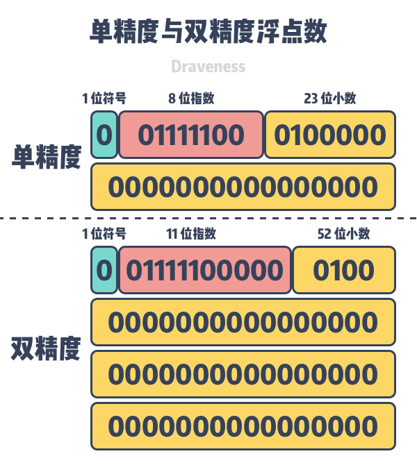

## float 64 运算

### 运算精确的现象

不仅仅 javascript 存在，其他遵循 IEEE 754 标准的语言都存在

https://0.30000000000000004.com/
https://babbage.cs.qc.cuny.edu/IEEE-754.old/Decimal.html

rust go php javascript
f32 float32 float -
f64 float64 double number



指数范围
[-1074, 971]

```js
var a = (Math.pow(2, 53) - 1) * Math.pow(2, 971);
console.log(a);
var b = Number.MAX_VALUE;
console.log(b);
```

```js
var a = 1 * Math.pow(2, -1074);
console.log(a);
var b = Number.MIN_VALUE;
console.log(b);
```

### 算数运算

算数运算都是二进制 01 运算，非常方便整数，但对于浮点数而言就扯淡

小数点后面 0.5 - 0.25 0.125 0.0625 ...

| 十进制 | 二进制           | 计算方式                                                                           |
| ------ | ---------------- | ---------------------------------------------------------------------------------- |
| 0.5    | 0.1              | 1 \* 0.5                                                                           |
| 0.375  | 0.011            | 0 \* 0.5 + 1 \* 0.25 + 1 \* 0.125                                                  |
| 0.3    | 0.01001          | 0 \* 0.5 + 1 \* 0.25 + 0 \* 0.125 + 0 \* 0.0625 + 1 \* 0.03125 + 1 \* 0.015625 ... |
| 0.1    | 0.00011001100... |                                                                                    |
| 0.2    | 0.00110011001... |                                                                                    |


```js
// 0.1
e = -4;
m = 1.1001100110011001100110011001100110011001100110011010 (52位)

// 0.2
e = -3;
m = 1.1001100110011001100110011001100110011001100110011010 (52位)
```

```js
// 0.1
e = -3;
m = 0.1100110011001100110011001100110011001100110011001101 (52位)

// 0.2
e = -3;
m = 1.1001100110011001100110011001100110011001100110011010 (52位)
```

1100110011001100110011001100110011001100110011001101
+
1001100110011001100110011001100110011001100110011010
=
2101210121012101210121012101210121012101210121012111
-> 把二的都进一得到
2110011001100110011001100110011001100110011001100111
->
1.2110011001100110011001100110011001100110011001100111
->
2.0110011001100110011001100110011001100110011001100111
->
10.0110011001100110011001100110011001100110011001100111

e = -3
m = 10.0110011001100110011001100110011001100110011001100111
->
e = -2
m = 1.00110011001100110011001100110011001100110011001100111 (53 位)

53位溢出，截断数字
e = -2
m = 1.0011001100110011001100110011001100110011001100110011 (52 位)

继续截断
e = -1
m = 0.1001100110011001100110011001100110011001100110011011

继续截断
e = 0
m = 0.010011001100110011001100110011001100110011001100110100