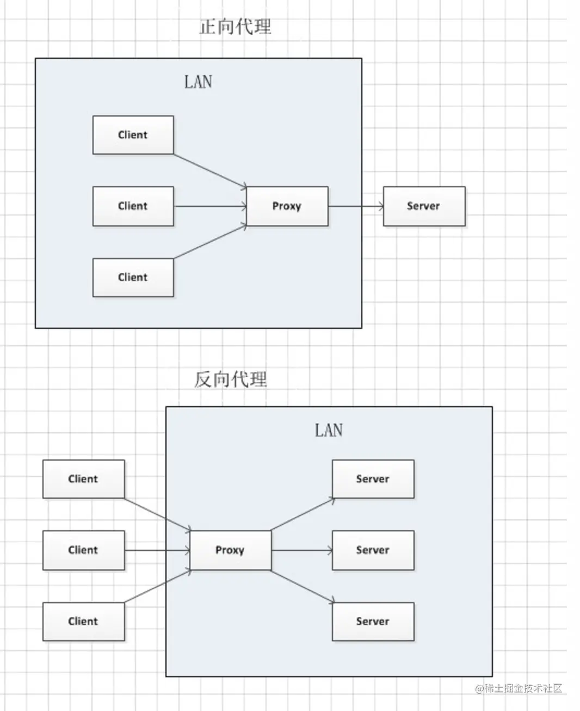

### 代理

- 正向代理 (HTTP/Socket5/v2ray/shadowSocket)
- 反向代理 (Nginx/Apache)

### 开发遇到的问题

1. 无法调试线上网站
2. 无法调用不允许跨域的接口

### 开发一个反向代理工具

1. 流（读 read/写 write/转换 transform）

客户端 -> 代理服务器 -> https://google.com

2. 不仅是请求转发

请求域名 Host
请求域名 Origin
Referrer
X-Forward-To
X-Read-IP

3. IP 伪造

5. Cors

5. 重定向 Location

301 -> 302

6. Cookies 重写

Secure -> false

<!-- https://developer.mozilla.org/zh-CN/docs/Web/HTTP/CSP -->
7. Content-Security-Policy

8. 替换内容

- Content-Encoding: 先解码

- 替换 URL: https://www.baidu.com -> http://localhost

<!-- https://developer.mozilla.org/zh-CN/docs/Web/Security/Subresource_Integrity -->
- 移除 integrity