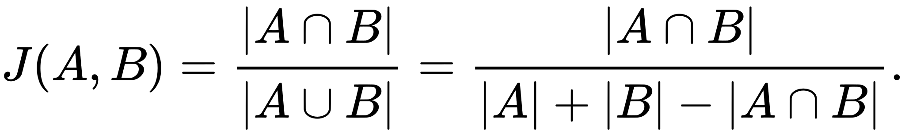
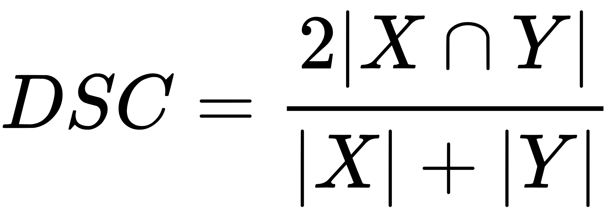

## 比较两个字符串的相似度

在计算机科学中， 字符串近似匹配（通常俗称为字符串模糊查询)，是一种字符串查找技术，用来近似匹配一个模式，而不是完全匹配。

### 1. 杰卡德距离 [Jaccard Distance](https://en.wikipedia.org/wiki/Jaccard_index)



```js
/*
 * 返回交集元素
 */
function intersection(a, b) {
  const x = [];

  for (const e of a) {
    if (b.indexOf(e) > -1) {
      x.push(e);
    }
  }

  return x;
}

/*
 * 返回并集元素
 */
function union(a, b) {
  const x = [];

  function check(e) {
    if (x.indexOf(e) < 0) x.push(e);
  }

  a.forEach(check);
  b.forEach(check);

  return x;
}

function index(a, b) {
  return intersection(a, b).length / union(a, b).length;
}

/*
 * 计算相似度
 */
function distance(a, b, c) {
  return Math.max(1 - index(a, b), 0);
}

console.log(distance("a".split(""), "ab".split(""))); // 0.5
console.log(distance("ba".split(""), "ab".split(""))); // 0
console.log(distance("foo bar".split(""), "bar foo".split(""))); // 0
```

### 2. 相似度(骰子)系数 [Sorensen Dice](https://en.wikipedia.org/wiki/S%C3%B8rensen%E2%80%93Dice_coefficient#Name)



值越小越不相同，最大值 = 1

与第一点不同

> It is different from the Jaccard index which only counts true positives once in both the numerator and denominator. DSC is the quotient of similarity and ranges between 0 and 1.[9] It can be viewed as a similarity measure over sets.

https://github.com/words/dice-coefficient

### 3. 莱文斯坦距离 [Levenshtein 距离](https://zh.wikipedia.org/zh-hans/%E8%90%8A%E6%96%87%E6%96%AF%E5%9D%A6%E8%B7%9D%E9%9B%A2)

莱文斯坦距离，又称 Levenshtein 距离，是编辑距离的一种。指两个字串之间，由一个转成另一个所需的最少编辑操作次数。

允许的编辑操作包括：

- 将一个字符替换成另一个字符
- 插入一个字符
- 删除一个字符

```js
/**
 * @param {string} word1
 * @param {string} word2
 * @return {number}
 */
var minDistance = function (word1, word2) {
  const dp = [];
  const m = word1.length;
  const n = word2.length;

  for (let i = 0; i < m + 1; i++) {
    const tmp = [];
    for (let j = 0; j < n + 1; j++) {
      if (i === 0) {
        tmp.push(j);
      } else if (j === 0) {
        tmp.push(i);
      } else {
        tmp.push(0);
      }
    }
    dp.push(tmp);
  }

  console.log(dp);

  for (let i = 1; i < m + 1; i++) {
    for (let j = 1; j < n + 1; j++) {
      if (word1[i - 1] === word2[j - 1]) {
        dp[i][j] = dp[i - 1][j - 1];
      } else {
      }

      const cost = word1[i - 1] === word2[j - 1] ? 0 : 1;

      dp[i][j] = Math.min(
        dp[i - 1][j] + 1, // 删除
        dp[i][j - 1] + 1, // 插入
        dp[i - 1][j - 1] + cost // 替換
      );
    }
  }
  return dp[m][n];
};
```

### 4. 汉明距离

### 5. 余弦相似性

## 扩展 - 欧几里得几何距离
