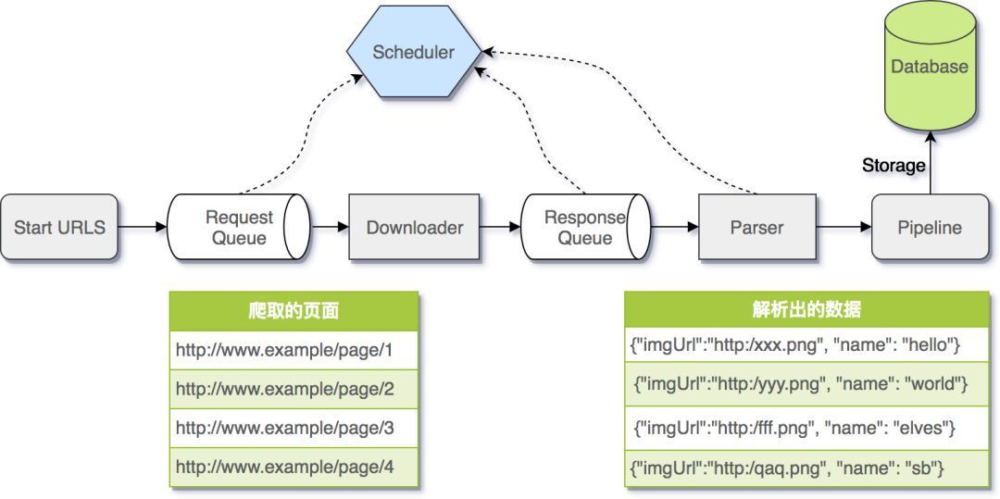

### 爬虫

### 爬虫的应用

1. 抓qu信息    
2. 搜索引擎索引 SEO

### 知名的爬虫框架

- Scrapy (python)
- pyspider (python)
- colly (Golang)
- crawlab (Golang)

### 如何去写爬虫？

任何语言都可以写爬虫，只要有网络功能。但大家肯定是选择最方便的脚本语言，一般来说是 Python 或者 Javascript。

#### 爬虫的构成部分

入口

1. URL管理

一个存储 URL 的队列

2. 下载器

下载要爬取的资源

3. 爬虫调度器 (调用频次/调用频率/重试次数/过滤重复)
4. 网页解析器 (HTML/JSON/XML/YML) XPATH/CSS
5. 数据处理器 (OSS/database)

### 反爬手段

- IP 检测
- 复杂的验证码
- 节流(rate limit)
- 复杂的加密算法
- 文件换成字体
- Canvas 渲染
- Header 头信息校验
- ...

### 法律风险

- 侵犯公民个人信息罪: 违反国家有关规定，向他人出售或者提供公民个人信息，情节严重的，处三年以下有期徒刑或者拘役，并处或者单处罚金；情节特别严重的，处三年以上七年以下有期徒刑，并处罚金。

- 非法侵入计算机信息系统罪

- 非法获取计算机信息系统数据、非法控制计算机信息系统罪

- 破坏计算机信息系统罪

- 侵犯著作权罪
