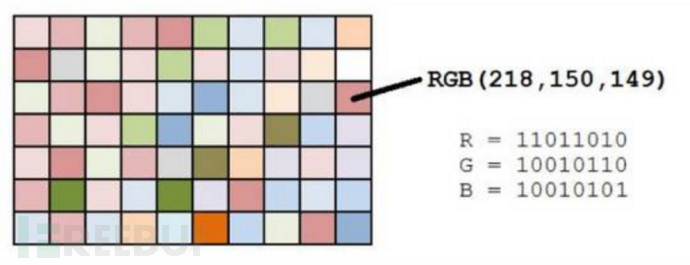
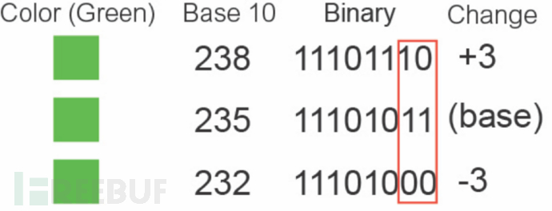

### 隐写术（Steganography）

### 如何在一张图片中隐藏信息

### PNG 图片格式

### 头部信息

89 50 4E 47 0D 0A 1A 0A

0x89 超出了 ASCII 的[编码范围](https://baike.baidu.com/item/ASCII/309296)（0x00 ～ 0x7F），所以一般的编辑器打开，都不会把它当成文本

### LSB (least significant bit)

我们知道，图片的像素信息，有几个要素组成

- R
- G
- B

对应的颜色信息是 rgb(0, 0, 0) - rgb(255, 255, 255)

每一种颜色占用 8 位字节

255 - 2^8 = 256

比如颜色 rgb(0,0,0)

00 00 00 00
00 00 00 00
00 00 00 00

比如颜色 rgb(128,128,128)

10 00 00 00
10 00 00 00
10 00 00 00

比如颜色 rgb(255,255,255)

11 11 11 11
11 11 11 11
11 11 11 11

> 小提示：rgb 和 Hex 的转换
> #000 -> rgb(0, 0, 0)
> #fff -> rgb(255, 255, 255)



总共有 256^3 = 16,777,216，但人眼大约只能识别 1000 中颜色，这就意味着一些细微的颜色变化，人眼是分别不出来的

而 LSB 隐写算法就是去修改 RGB 颜色分量的最低二进制位也就是最低有效位（LSB），人类的眼睛不会注意到这前后的变化，每个像素可以携带 3 比特的信息。



[渲染细微的色差](color_example.html)

**LBS 大致步骤：**

1. 准备一张【原图】和【水印图】
2. 将水印图二值化（转换为二进制 01010101）
3. 将原图的 RGB 三色的最后一个 bit 全部置 0
4. 将用 1bit 表示的二值化的水印信息添加到原图最后 1bit 上

### 合并水印图片

[即将一张图片隐藏到另一张图片](merge_img.html)

### 合并一段 text

```js
// 首先要把一段 text 转换为二进制
var binary = "hello world"
  .split("")
  .map((v) => v.charCodeAt(0))
  .map((v) => v.toString(2))
  .map((v) => v.padStart("8", "0"))
  .join("");

console.log(binary);

var ints = [];

for (let i = 0; i < binary.length; i += 8) {
  let char = [];
  char.push(binary[i]);
  char.push(binary[i + 1]);
  char.push(binary[i + 2]);
  char.push(binary[i + 3]);
  char.push(binary[i + 4]);
  char.push(binary[i + 5]);
  char.push(binary[i + 6]);
  char.push(binary[i + 7]);

  ints.push(parseInt(char.join(""), 2));
}

console.log(ints);

new TextDecoder().decode(new Uint8Array(ints));
```

## 用途

- 加密信息传输
- 盗图和防盗图
- 添加隐藏水印